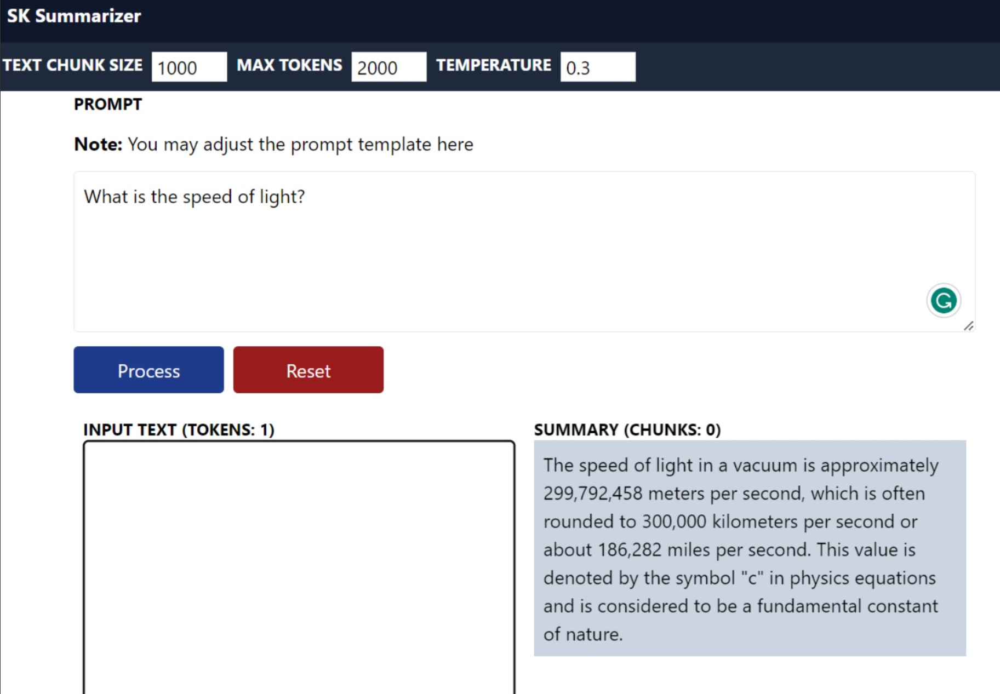
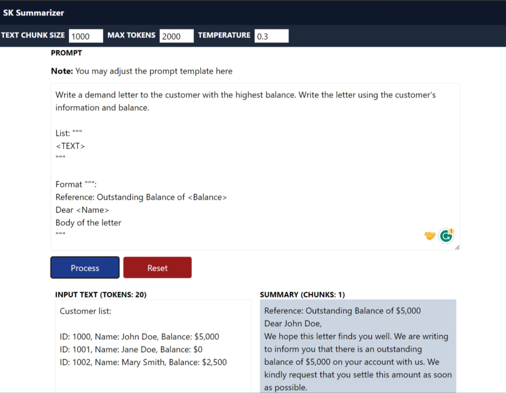
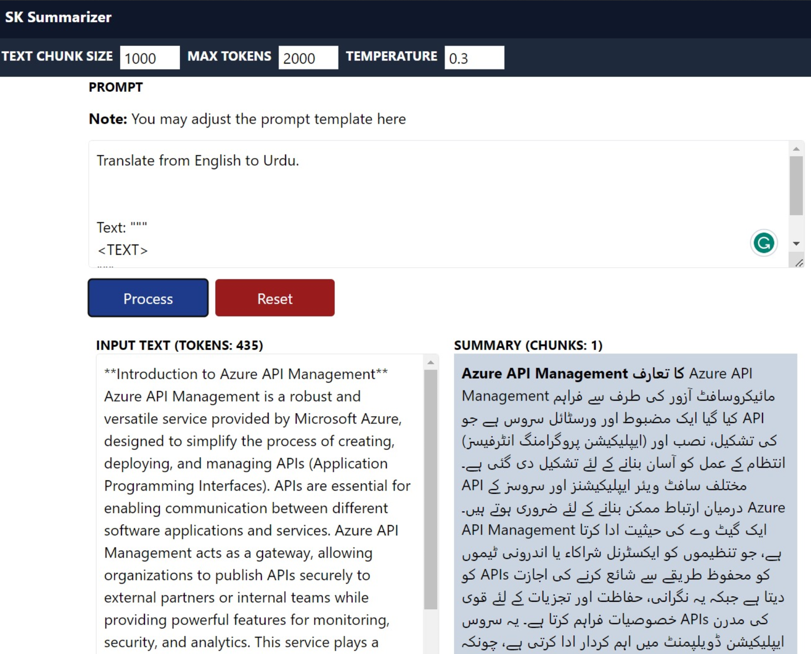

# An AOAI Summarizer implementation with Semantic Kernel

This a summarizer (Map Reduce/Refine) implementation using Semantic Kernel and OpenAI GPT. This application can use the GPT's foundational model abilities to summarize, translate, analyze risks, etc. a large text source.

I implemented this app as a C# Minimal API serving both static files and acting as an API server, but with minor modifications, the same code could power an async job to process a large number of files, for example, in a storage account.

Summarizer is also a powerful playground. You don’t need to give it a large text source. It can reply to a simple prompt. However, if you do give it a large text source as a resource, you can accomplish pretty amazing things.

Summarization and RAG pattern can be combined into a powerful solution where based on users' choices they could get answers from multiple sources using the RAG pattern or deep answers from specific documents and sources using summarization.

## Frontend

- Bun
- React
- Axios
- React-markdown

## Server

- .NET 7 C# Minimal API
- Static Files
- Semantic Kernel

## Required server environment variables

On the `server` folder, you will need to create a `.env` file and add the following values:

```bash
DEPLOYMENT_NAME=<MODEL_NAME>
ENDPOINT=https://<NAME>.openai.azure.com/
API_KEY=<API_KEY>
```

### Running locally

- cd into the `server` folder
- Type: `make run`
- Open a browser at: `http://localhost:5084`

### Run a container locally with Docker

- cd into the `server` folder
- Type: `make docker-run`
- Open a browser at: `http://localhost:8080`

### Build Docker Container

- cd into `server` folder
- Type: `make docker`

**Note:** Make sure to provide the required server environment variables if running from somewhere else.

## Samples

### Simple query



### Generate a letter



### Translation


