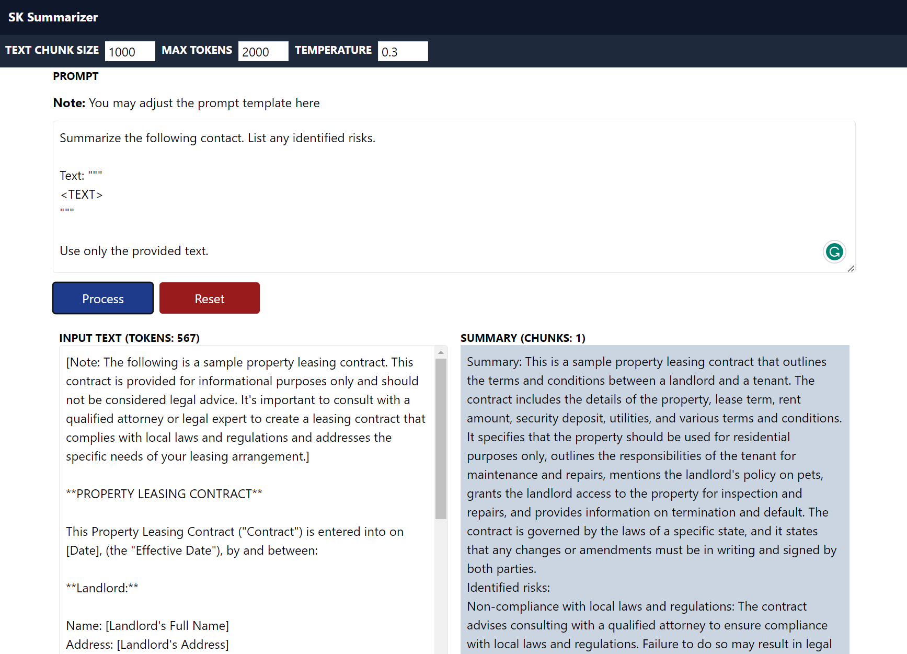
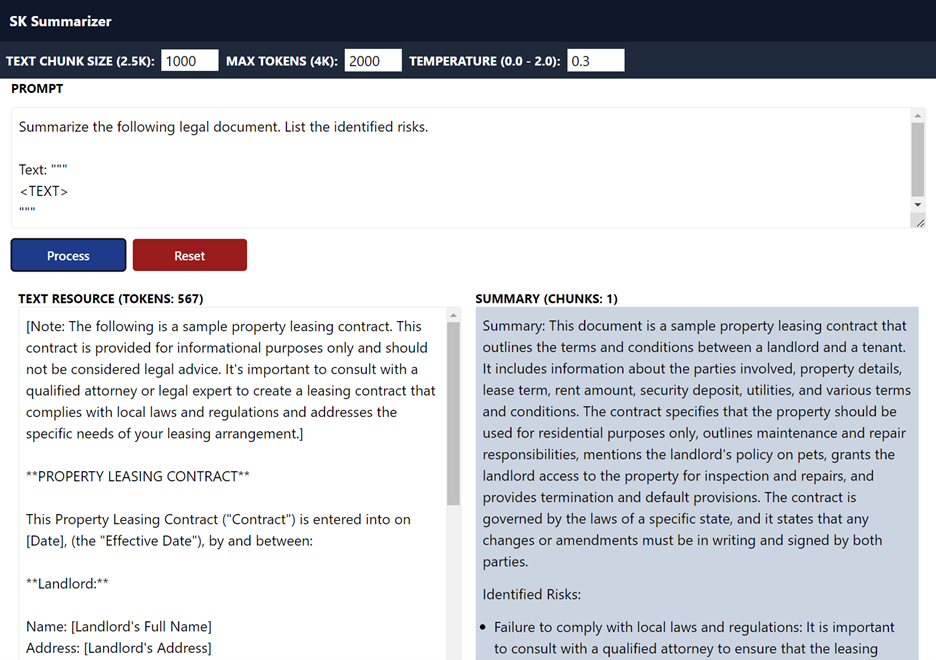

# An Azure OpenAI Summarizer implementation<br/>with Semantic Kernel

This a summarizer (Map Reduce/Refine) implementation using Semantic Kernel and OpenAI GPT. This application can use the GPT's foundational model abilities to summarize, translate, analyze risks, etc. a large text source.

I implemented this app as a C# Minimal API serving both static files and acting as an API server, but with minor modifications, the same code could power an async job to process a large number of files, for example, in a storage account.

Summarizer is also a powerful playground. You don’t need to give it a large text source. It can reply to a simple prompt. However, if you do give it a large text resource, you can accomplish pretty amazing tasks.

Summarization and RAG pattern can be combined into a powerful solution where based on users' choices the system could answer from multiple sources using the RAG pattern or provide deep answers and insights from specific documents and sources using summarization.

## Frontend

**Note:** I've kept most of the code in the `frontend/src/App.tsx`` file for simpler understanding.

- Bun javascript runtime and all-in-one tool
- React
  - Axios
  - React-markdown
- TailwindCSS

## Server

- .NET 7 C# Minimal API
- Semantic Kernel (still in Preview)
- Middleware:
  - Static Files
  - CORS

## Required Server environment variables

**Note:** To ge these values, you will need an Azure OpenAI account and deploy a GPT model to a region.

On the `server` folder, you will need to create a `.env` file and set the following values:

```bash
DEPLOYMENT_NAME=<MODEL_NAME>
ENDPOINT=https://<NAME>.openai.azure.com/
API_KEY=<API_KEY>
```

### Running locally

- cd into the `server` folder
- Type: `make run`
- Open a browser at: `http://localhost:5084`

### Run as a container locally using Docker

- cd into the `server` folder
- Type: `make docker-run`
- Open a browser at: `http://localhost:8080`

### Building a Docker Container

**Note:** Make sure to provide the required server environment variables if running from somewhere else.

- cd into `server` folder
- Type: `make docker`

## Samples use cases

### Process a simple query


### Content generation


### Text translation


### Summarization



### Summarization and risk analysis


